# Voorbeeldthema&#39;s, sjablonen en modellen formuliergegevens in kerncomponenten {#sample-themes-templates-and-data-models}

[!DNL AEM Forms] Core Components biedt gebruiksklare voorbeeldthema&#39;s, sjablonen en modellen van formuliergegevens om snel flexibele formulieren te maken. Deze helpen auteurs ook om de uitbreidbaarheid, het aanpassingsvermogen en de responssnelheid van te leren [AEM Forms Core-componenten](https://experienceleague.adobe.com/docs/experience-manager-core-components/using/adaptive-forms/introduction.html) om eenvoudige formulieren in een handomdraai en eenvoudig complexe formulieren te maken terwijl u naadloos verbinding maakt met de database.

De voorbeeldthema&#39;s, sjablonen en modellen van formuliergegevens in het pakket met referentie-inhoud zijn:

| Sjablonen | Thema&#39;s | Formuliergegevensmodellen |
---------|----------|---------
| [Basis](#Basic) | [Canvas](#Canvas) | Microsoft® Dynamics 365 |
| [Leeg](#Blank) | [WKND](#WKND) | Salesforce |
| [Contact opnemen](#Contact-Us) | [Easel](#Easel) |  |
| [Update van contactgegevens](#Contact-Details-Update) |   |   |
| [Formulier voor goedkeuring](#Consent-Form) | |  |
| [Aanvraag voor logservice](#Log-Service-Request) |  |  |
| [Feedback geven](#Give-Feedback) |  |  |
| [Inschrijving voor voordelen](#Benefits-Enrollment) |  |   |
| [Overzicht van personeelsbeloningen](#Employee-Benefits-Summary) |   |   |
| [Verzoek om een rekeningafschrift](#Request-for-Account-Statement) |   |   |
| [Veiligheidsinspectieformulier](#Safety-Inspection) |   |   |
| [Kwaliteitscontrole](#Quality-Control-Inspection) |   |   |
| [Aankoopaanvraag](#Purchase-Request) |  |  |

## Voorbeeldthema&#39;s {#Sample-Themes}

Met referentiemonsteringsthema&#39;s kunnen auteurs stijlen definiëren en aanpassen voor formulieren. Auteurs met zelfs een basiskennis van CSS kunnen thema naar behoefte aanpassen.

**Hoe krijg je deze thema&#39;s?**
* Deze thema&#39;s inschakelen **Forms as a Cloud Service** milieu, [Adaptieve Forms Core-componenten inschakelen](https://experienceleague.adobe.com/docs/experience-manager-cloud-service/content/forms/setup-configure-migrate/enable-adaptive-forms-core-components.html) en gebruiken de [front-end pijpleiding](https://experienceleague.adobe.com/docs/experience-manager-cloud-service/content/forms/adaptive-forms-authoring/authoring-adaptive-forms-core-components/create-an-adaptive-form-on-forms-cs/using-themes-in-core-components.html) om deze thema&#39;s te implementeren.
* Deze thema&#39;s op een **AEM 6,5 Forms** milieu, [Adaptieve Forms Core-componenten inschakelen](https://experienceleague.adobe.com/docs/experience-manager-65/forms/adaptive-forms-core-components/enable-adaptive-forms-core-components.html) en gebruiken de [pakketbeheer](https://experienceleague.adobe.com/docs/experience-manager-65/forms/adaptive-forms-core-components/create-or-customize-themes-for-adaptive-forms-core-components) om deze thema&#39;s te implementeren.

De **uit de doos** [Adaptieve Core-componenten van formulieren](https://experienceleague.adobe.com/docs/experience-manager-core-components/using/adaptive-forms/introduction.html) de thema &#39; s worden als volgt beschreven :

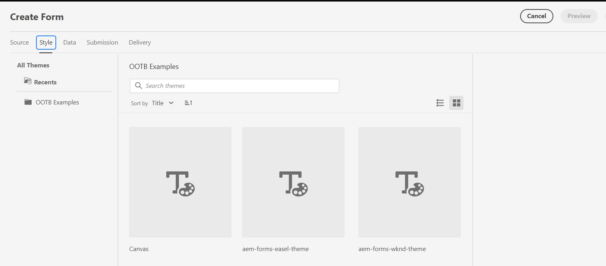

### Canvas {#Canvas}

Canvas-thema is het standaardthema voor formulieren en benadrukt het gebruik van basiskleuren, transparantie en platte pictogrammen. In de onderstaande schermafbeelding kunt u zien hoe het thema Canvas eruitziet.

### WKND {#WKND}

Het WKND-thema belichaamt een levendig, verbeeldend en boeiend ontwerp om uw formulieren een stijlvol uiterlijk te geven. Het thema is gebaseerd op de vormgeving en opmaak van [WKND-site](https://wknd.site/us/en.html) de website voor reizen en avontuur is gebaseerd op [Adobe Experience Manager Core-componenten](https://experienceleague.adobe.com/docs/experience-manager-core-components/using/adaptive-forms/introduction.html).

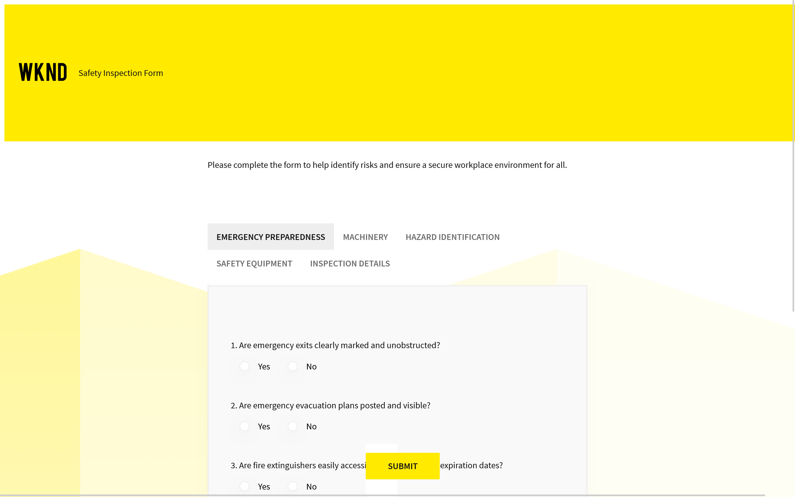

### Easel {#Easel}

Met het thema Easel kunt u een aantrekkelijk en eenvoudig in te stellen formulier maken dat is aangepast aan de eenvoud en gebruiksvriendelijkheid. Het Easel-thema is gebaseerd op het concept waar een draagbare standaard die kunstenaars gebruiken om een canvas te ondersteunen terwijl ze aan hun schilderijen werken.

## Voorbeeldsjablonen {#Sample-templates}

Sjablonen definiëren de initiële formulierstructuur, inhoud en handelingen die in het formulier moeten worden herhaald of gebruiken een vergelijkbare sjabloonstructuur als het formulier, zoals Goedkeuring, Voordelen, Inschrijvingsformulier en nog veel meer.

**Hoe krijg je deze sjablonen?**
U kunt de malplaatjes krijgen door op te stellen [Project met AEM Archetype 43 of hoger](https://github.com/adobe/aem-project-archetype) aan uw **AEM Forms as a Cloud Service** of **AEM 6,5** Forms-omgeving

De **uit de doos** [Adaptieve Core-componenten van formulieren](https://experienceleague.adobe.com/docs/experience-manager-core-components/using/adaptive-forms/introduction.html) sjablonen worden als volgt beschreven:

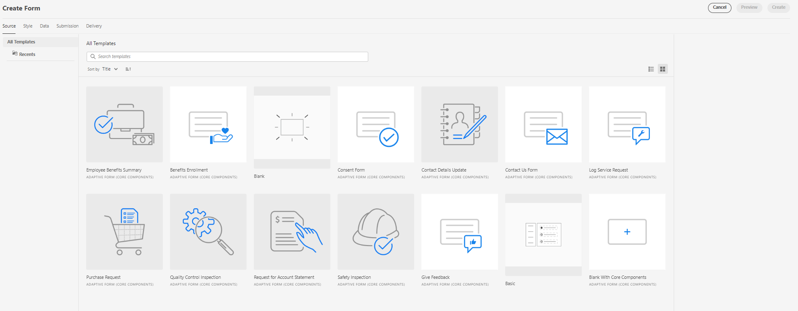

### Basis {#Basic}

Met de basissjabloon kunt u snel een formulier voor inschrijvingservaring maken. U kunt het ook gebruiken om functionaliteit voor voorvertoningen van [Adaptieve Forms Core-componenten](https://experienceleague.adobe.com/docs/experience-manager-core-components/using/adaptive-forms/introduction.html). Het verstrekt een tovenaar lay-out voor sectie-door-sectie presentatie van gegevens.

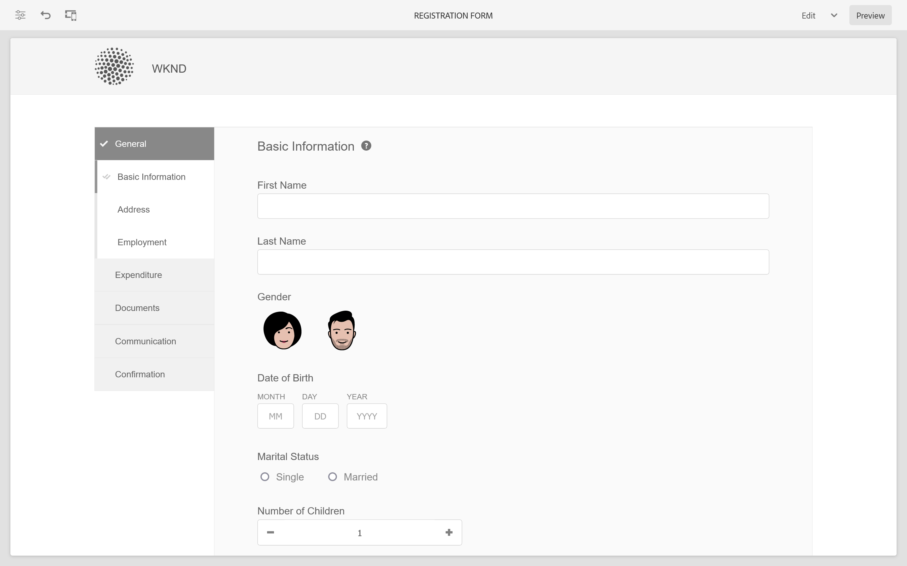

### Leeg {#Blank}

Een lege canvassjabloon wordt gebruikt om een adaptieve formulierstructuur, inhoud en helemaal nieuwe regels te maken. Er zijn geen formuliercomponenten vooraf opgenomen in de lege sjabloon.

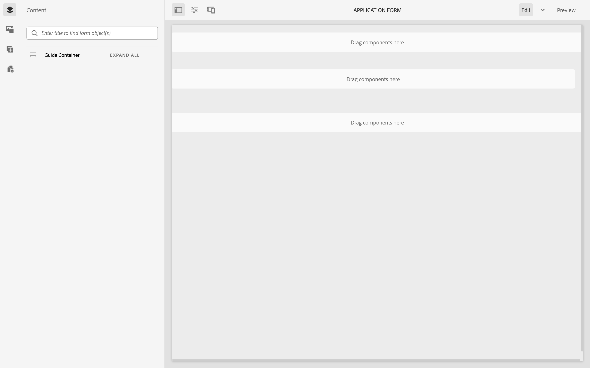

### Contact opnemen {#Contact-Us}

Met de formuliersjabloon Contact opnemen wordt een formulier gemaakt waarmee bezoekers van de website en formulierbeheerders gemakkelijker kunnen communiceren. Gebruikers kunnen via het formulier query&#39;s, feedback of ondersteuningsverzoeken verzenden.

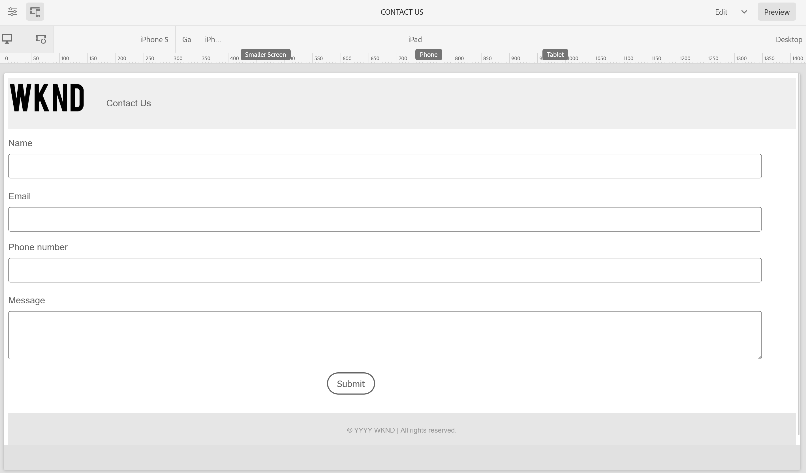

### Update contactgegevens {#Contact-Details-Update}

Auteurs van de updatesjabloon voor contactgegevens kunnen een formulier maken voor het bijwerken van adres- en contactgegevens van klanten. Het formulier helpt klanten ook bij het bijwerken van persoonlijke informatie met betrekking tot abonnementen of voordelen, zodat u een naadloze communicatie en ononderbroken toegang tot de services of voordelen kunt garanderen.

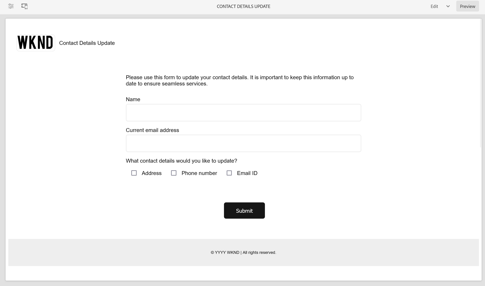

### Goedkeuringsformulier {#Consent-Form}

Met een formuliersjabloon voor instemming wordt een formulier gemaakt voor de aanschaf van een juridisch document van deelnemers die deelnemen aan een specifieke activiteit, een onderzoeksstudie, een medische procedure of een situatie waarin hun persoonlijke informatie of rechten in het geding kunnen komen. Het formulier zorgt voor transparantie, beschermt de rechten van de deelnemer en geeft een duidelijk inzicht in wat het individu ermee instemt.

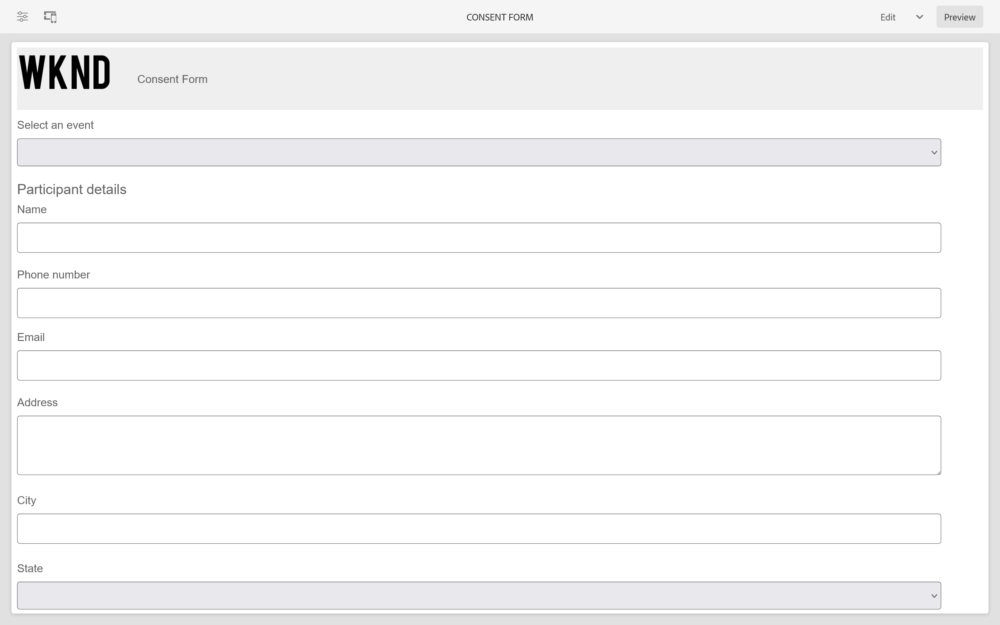

### Aanvraag voor logservice {#Log-Service-Request}

De de dienstverzoekmalplaatje van het logboek helpt tot een vorm leiden die logboek-specifieke het registreren diensten van een dienstverlener vraagt. Het formulier fungeert als een formeel verzoek om een ticket te maken voor gebeurtenissen, activiteiten of gegevens die zijn geregistreerd voor het controleren of bijhouden van de status.

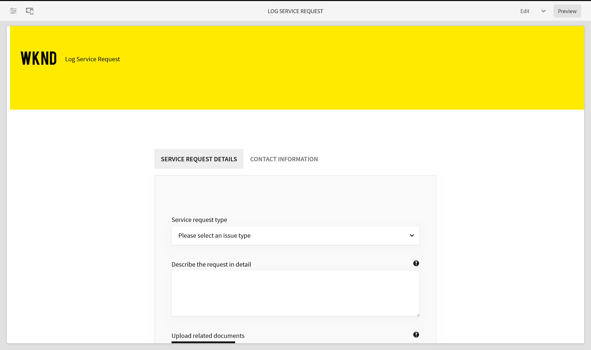

### Feedback geven {#Give-Feedback}

Met een feedbackformuliersjabloon kunt u een formulier samenstellen om een andere persoon of een ander team constructieve feedback te geven. Het formulier helpt ervoor te zorgen dat feedback duidelijk, specifiek en handelbaar is en open communicatie en verbetering bevordert.

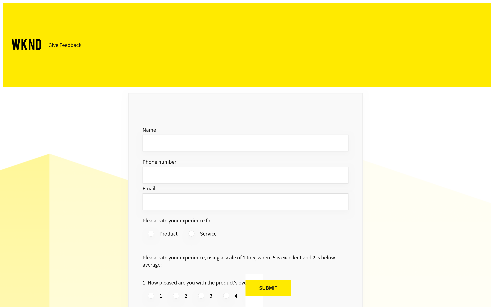

### Inschrijving voordelen {#Benefits-Enrollment}

Het inschrijvingsformuliersjabloon wordt gebruikt om een formulier te maken voor het verzamelen van essentiële informatie van hun werknemers over hun voorkeursvoordelen en dekkingsopties. Het gaat doorgaans vergezeld van de jaarlijkse periode waarin uitkeringen worden ingeschreven.

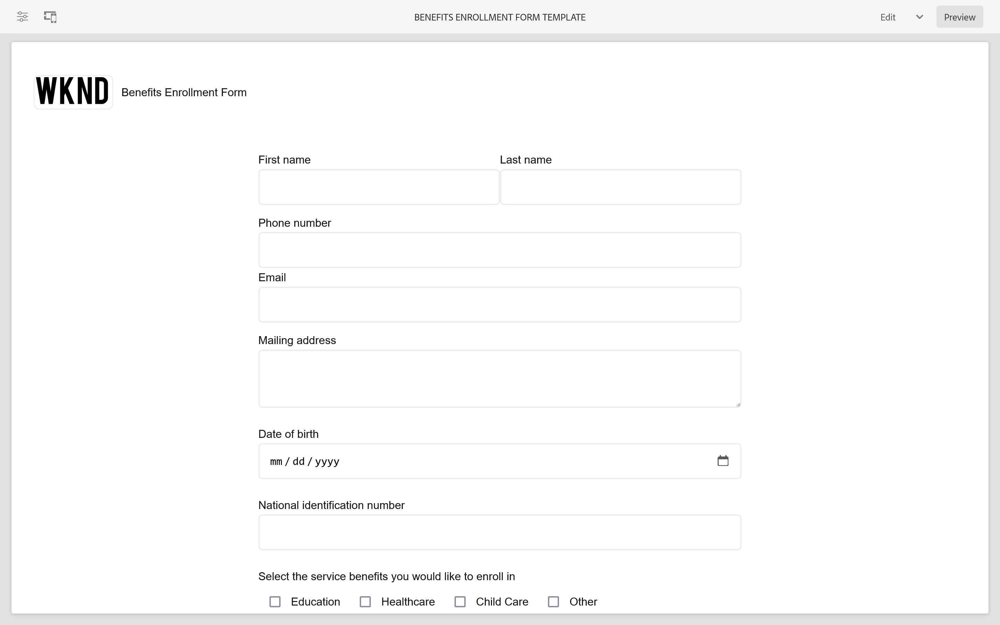

### Overzicht personeelsbeloningen {#Employee-Benefits-Summary}

Samenvattingsformuliersjabloon voor personeelsbeloningen wordt gebruikt om een formulier te maken voor het verzamelen van essentiële details over de prestaties van een individu. Het helpt om dekking snel en nauwkeurig te evalueren, die een uitvoerig overzicht voor efficiënte hulp en steun verstrekken.
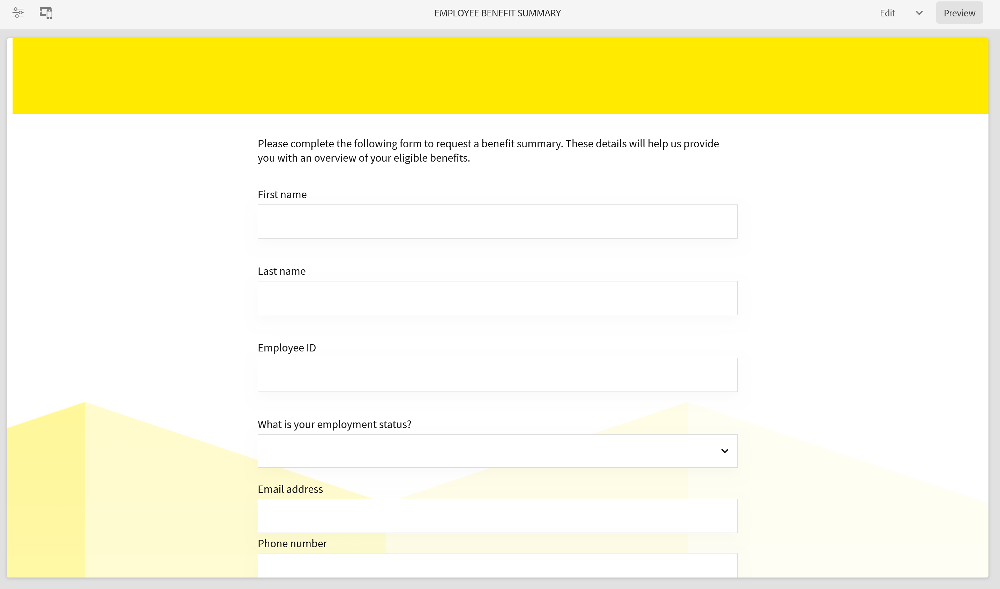

### Verzoek om accountverklaring {#Request-for-Account-Statement}

Met de sjabloon Aanvragen voor accountinstructies kunt u een formulier maken dat het proces voor het verkrijgen van een nauwkeurige en actuele klantverklaring start. Het overzicht bevat een gedetailleerd overzicht van financiële transacties, activiteiten of andere relevante informatie over klanten die dit formulier gebruiken.

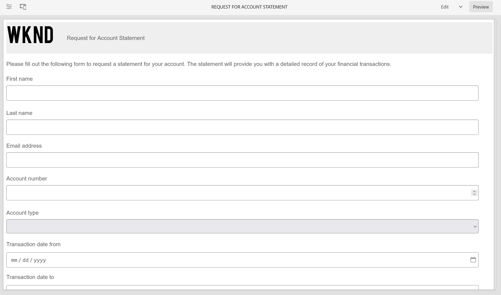

### Veiligheidscontrole {#Safety-Inspection}

Met het sjabloon van het formulier voor veiligheidscontroles kunt u een formulier maken om gegevens in te voeren voor een veilige werkomgeving. Door regelmatige inspecties uit te voeren met behulp van dit formulier kunnen mogelijke gevaren worden geïdentificeerd. Het formulier heeft betrekking op diverse aspecten, zoals nooduitgangen, brandveiligheid, elektrische veiligheid, gevaarlijke materialen, persoonlijke beschermingsmiddelen, ergonomie van het werkstation voor de veiligheid en het welzijn van werknemers, bezoekers en klanten.

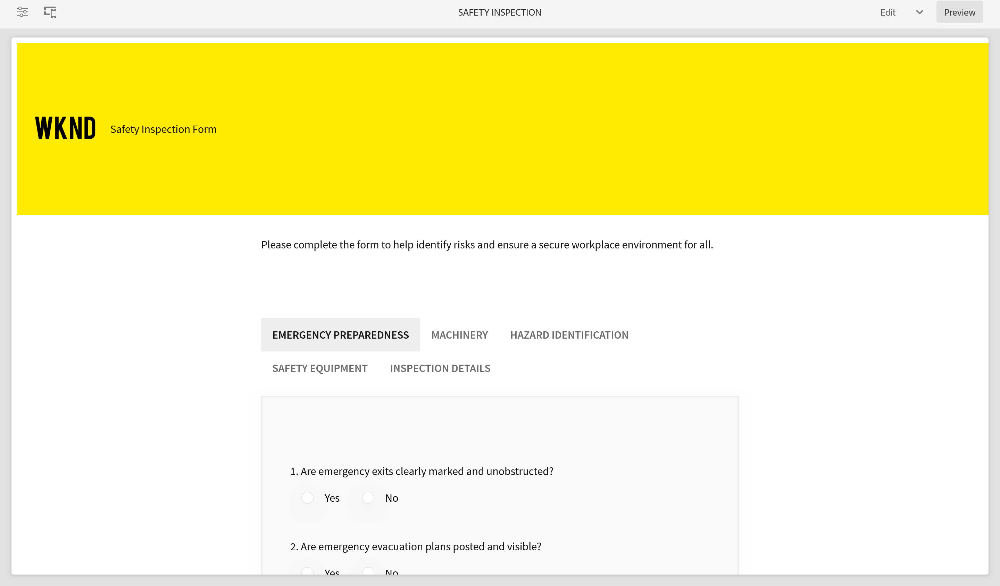

### Kwaliteitscontrole {#Quality-Control-Inspection}

Met het voorbeeldformulier voor kwaliteitscontrole kunt u een formulier maken voor het beoordelen en documenteren van de visuele weergave, afmetingen, functionaliteit, documentatie, testresultaten en algemene kwaliteit van een product of item. Het helpt gebreken, afwijkingen, en correctieve acties identificeren noodzakelijk om naleving van kwaliteitsnormen te verzekeren.

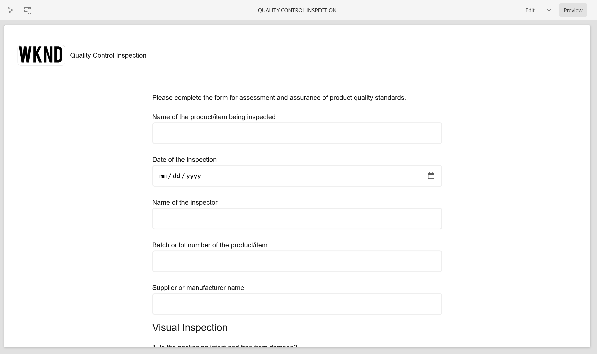

### Aankoopaanvraag {#Purchase-Request}

Met een formulier voor inkoopaanvragen kunt u een formulier maken waarmee het aanbestedingsproces kan worden geïnitieerd en werknemers de mogelijkheid krijgen formeel de aankoop van goederen of diensten aan te vragen die nodig zijn voor hun werk. In het formulier worden essentiële gegevens opgenomen, zoals de beschrijving van de artikelen, de hoeveelheid, de leverancier van de voorkeursleverancier (indien van toepassing), de toewijzing van het budget, de rechtvaardiging voor de aankoop, de leveringsinformatie en de vereiste goedkeuringen.

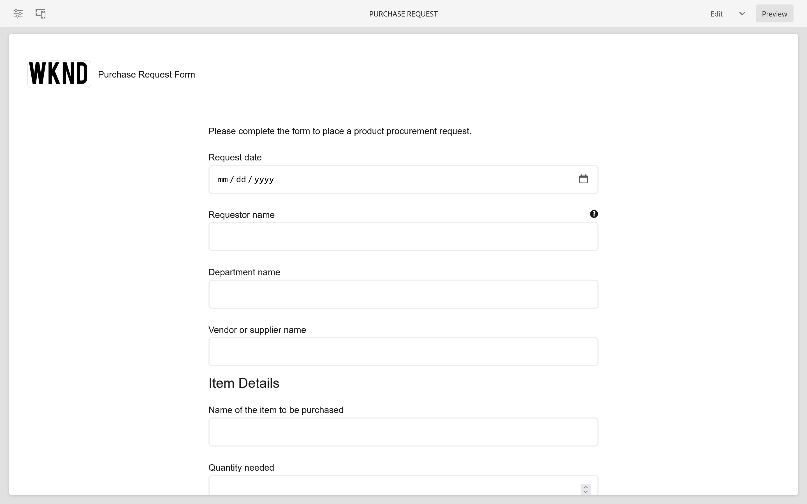

## Referentieformuliergegevensmodellen {#reference-models}

Nadat u een adaptief formulier hebt gemaakt op [Kerncomponent](https://experienceleague.adobe.com/docs/experience-manager-core-components/using/adaptive-forms/introduction.html), kunt u uw formulier verbinden met de database Microsoft® Dynamics 365 en Salesforce-servers om bedrijfsworkflows mogelijk te maken. Bijvoorbeeld:

* Schrijf gegevens in Microsoft® Dynamics 365 en Salesforce over het verzenden van adaptieve formulieren.
* Schrijf gegevens in Microsoft® Dynamics 365 en Salesforce via aangepaste entiteiten die zijn gedefinieerd in het Form Data Model en vice versa.
* Vraag Microsoft® Dynamics 365 en Salesforce-server naar gegevens en vul Adaptive Forms vooraf in.
* Lees gegevens van Microsoft® Dynamics 365 en Salesforce-server.

U kunt de volgende modellen van de Gegevens van het Vorm krijgen door te installeren [Referentie-inhoudspakket](https://experience.adobe.com/#/downloads/content/software-distribution/en/aemcloud.html?package=/content/software-distribution/en/details.html/content/dam/aemcloud/public/aem-forms-reference-content.ui.content-2.1.0.zip):

* Microsoft® Dynamics 365
* Salesforce

Zie voor informatie over het gebruik van deze modellen [Microsoft® Dynamics 365 en Salesforce-cloudservices configureren](https://experienceleague.adobe.com/docs/experience-manager-cloud-service/content/forms/integrate/use-form-data-model/configure-msdynamics-salesforce.html#configure-dynamics-cloud-service)
