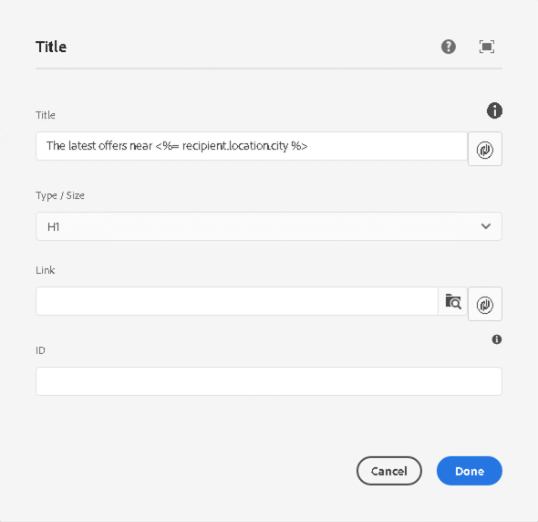

# Campagnevariabelen {#campaign-variables}

Gebruik campagnevariabelen om persoonlijke e-mailinhoud samen te stellen. Campagnevariabelen fungeren als plaatsaanduidingen voor Adobe Campaign-waarden die u in uw e-mailinhoud kunt invoegen. Wanneer de inhoud via Adobe Campaign wordt verzonden, worden deze variabelen vervangen door de gepersonaliseerde inhoud van de ontvanger.

## Gebruik {#usage}

Met de E-mail Core-componenten zijn campagnevariabelen gemakkelijk toegankelijk via aanpassingsknoppen naast veelgebruikte tekstvelden. Als u hierop drukt, wordt een dialoogvenster weergegeven waarin u een verpersoonlijkingsveld kunt selecteren.

De lijst met beschikbare personalisatievelden is gesynchroniseerd met uw Adobe Campaign-exemplaar. De velden worden in Adobe Campaign beheerd in het schema `nms:seedMember`. Alle velden in `nms:seedMember` moet ook aanwezig zijn in uw ontvankelijke lijst.

## Dialoogvenster Adobe Campaign-variabele selecteren {#dialog}

Het dialoogvenster Adobe Campaign-variabele selecteren is beschikbaar in veel bewerkingsdialoogvensters van de e-mailkerncomponenten. Als u het wilt gebruiken, klikt u op de knop **Adobe Campaign-variabele selecteren** pictogram naast het toepasselijke veld. Dit pictogram kan twee vormen aannemen.

Als u op beide pictogrammen klikt, wordt het dialoogvenster **Adobe Campaign-variabele selecteren** .

Gebruik de kolomweergave om de variabele te zoeken die u wilt invoegen. Wanneer u op een knooppunt in een kolom klikt, worden de onderliggende items in een nieuwe kolom rechts van het knooppunt weergegeven. Op deze manier kunt u door de structuur van de variabele-inhoud navigeren.

Selecteer de variabele die u wilt invoegen en klik op het vinkje rechtsboven in het dialoogvenster.

De variabele wordt vervolgens ingevoegd in het veld van het dialoogvenster Bewerken van de E-mailkerncomponent.

Klik op de X linksboven in het dialoogvenster om het dialoogvenster te annuleren en te sluiten.
